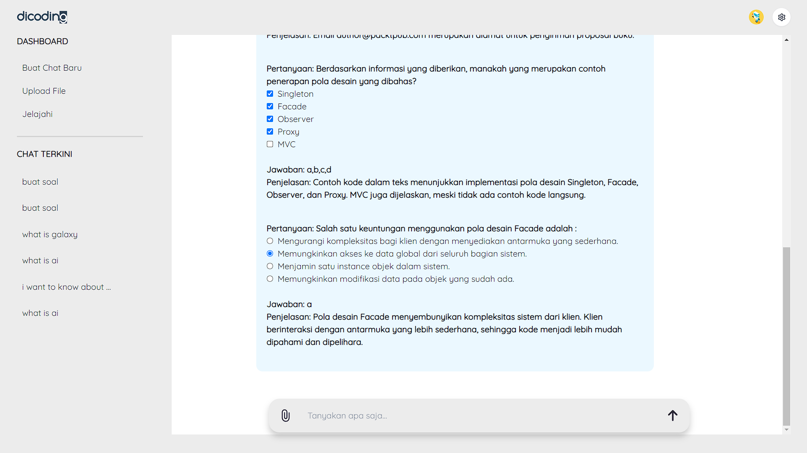

# Dicoding Generative AI Web Application

## Executive Summary


Indonesia’s educational technology sector faces significant challenges in leveraging Generative AI, particularly with Large Language Models (LLMs) like Google's Gemini for Bahasa Indonesia on Google Cloud. This project addresses these challenges by building a Generative AI system tailored for Dicoding, enabling automated, curriculum-aligned content generation and improving contextual accuracy in forums and chats.

Our solution integrates LLM with a MERN (MongoDB, Express, React, Node.js) web application, streamlining content creation, enhancing accessibility, and boosting learner engagement. By automating manual processes, this system establishes a scalable foundation for advancing AI-driven education in Indonesia.

---

## Features



- **Content Generation**: Automates the creation of curriculum-aligned content, reducing manual workload.
- **Improved Bahasa Indonesia Accuracy**: Fine-tuned responses for forums and chat support.
- **Dynamic Assessments**: Generates quizzes and assessments with varying complexity.
- **Seamless Integration**: Built on MERN architecture with Gemini LLM integration for Google Cloud.

---

### RAG (Retrieval-Augmented Generation) Features

- **File Upload**: Users can upload documents for RAG processing.
- **File Download**: Generated outputs can be downloaded as documents.
- **File Deletion**: Uploaded files can be deleted after use.

---

## Tech Stack

- **Frontend**: React.js
- **Backend**: Node.js with Express
- **Database**: MongoDB
- **AI Model**: n8n RAG Implementation with Ollama
- **Hosting (optional)**: Google Cloud Platform (GCP)

---

## Installation

### Prerequisites

1. Node.js and npm installed on your machine.
2. MongoDB instance running locally or on a cloud server.
3. Google account for Gemini API.
4. n8n RAG Implementation with Ollama
5. Optional: Google Cloud Platform (GCP)

### Setup Instructions

#### Frontend

1. Navigate to the frontend directory:
   ```bash
   cd client
   ```
2. Install dependencies:
   ```bash
   npm install
   ```
3. Start the development server:
   ```bash
   npm run dev
   ```

#### Backend

1. Navigate to the backend directory:
   ```bash
   cd backend
   ```
2. Install dependencies:
   ```bash
   npm install
   ```
3. Start the server:
   ```bash
   npm start
   ```

---

## Environment Variables

### Frontend `.env` Example
```env
VITE_CLERK_PUBLISHABLE_KEY=your_clerk_publishable_key
VITE_IMAGE_KIT_ENDPOINT=your_imagekit_endpoint
VITE_IMAGE_KIT_PUBLIC_KEY=your_imagekit_public_key
VITE_GEMINI_PUBLIC_KEY=your_gemini_public_key
VITE_API_URL=http://localhost:3000

# RAG related
VITE_POST_URL_AGENT=http://localhost:5678/webhook/agent
VITE_POST_URL_UPLOAD=http://localhost:5678/webhook/file/upload
VITE_POST_URL_DELETE_VECTOR=http://localhost:5678/webhook/file/delete
VITE_UPLOAD_DIR=C:/../../self-hosted-ai-starter-kit/shared/
```

### Backend `.env` Example
```env
IMAGE_KIT_ENDPOINT=your_imagekit_endpoint
IMAGE_KIT_PUBLIC_KEY=your_imagekit_public_key
IMAGE_KIT_PRIVATE_KEY=your_imagekit_private_key
CLIENT_URL=http://localhost:5173
MONGO=your_mongodb_connection_string
CLERK_PUBLISHABLE_KEY=your_clerk_publishable_key
CLERK_SECRET_KEY=your_clerk_secret_key

# RAG related
UPLOAD_DIR=C:/../../self-hosted-ai-starter-kit/shared/
```

---

## Usage

### Generating Content

1. Navigate to the web application.
2. Input prompts in Bahasa Indonesia for curriculum-aligned content or assessments.
3. View the generated output, fine-tuned for Dicoding's needs.

### Chat and Forum Support

- Use the chat/forum feature to ask questions. The system provides contextually accurate responses in Bahasa Indonesia.

### Document Upload, Download, and Delete (for RAG)

1. **Upload Document**:

- Users can upload documents to the system. The uploaded file will be sent to the n8n RAG endpoint for processing.
- Example: Upload a document to generate content based on its content.

2. **Download Document**:

- Once the document is processed, users can download the generated output or processed file.
- Example: A PDF or Word document containing the generated content.

3. **Delete Document**:

- Users can delete the uploaded document after processing.
- Example: Files that are no longer needed can be deleted to save storage space.

---

## How It Works

1. **Frontend**: React handles user input and communicates with the backend via API calls.
2. **Backend**: Node.js processes requests, interacts with Gemini API, and fetches data from MongoDB.
3. **n8n Integration**:
   - Prompts and files are sent to n8n via webhook.
   - Ollama handles the AI processing and generates output based on uploaded documents.
   - The processed content or document is returned to the user for download or further interaction.

---

## Deployment

1. Deploy the frontend using services like Vercel or Netlify.
2. Deploy the backend on a cloud hosting platform (e.g., Google Cloud or Heroku).
3. Ensure `.env` files are securely managed and credentials are not exposed.
4. Set up n8n in a Docker container for RAG implementation:
   - Configure webhook endpoints for file upload, processing, and deletion.
   - Ensure proper file permissions for accessing the UPLOAD_DIR.

---

## Contribution Guidelines

We welcome contributions! To contribute:

1. Fork the repository.
2. Create a new feature branch:
   ```bash
   git checkout -b feature-name
   ```
3. Commit your changes:
   ```bash
   git commit -m "Add feature description"
   ```
4. Push to your branch:
   ```bash
   git push origin feature-name
   ```
5. Open a pull request.

---

## Acknowledgements

- [n8n](https://n8n.io/)
- [Ollama](https://ollama.ai/)
- [Self-hosted AI Starter Kit](https://github.com/n8n-io/self-hosted-ai-starter-kit)
- [React](https://react.dev/)
- [Node.js](https://nodejs.org/)
- [Express](https://expressjs.com/)
- [MongoDB](https://www.mongodb.com/)
- [Clerk](https://clerk.com/)
- [ImageKit](https://imagekit.io/)
- [Google Cloud Platform](https://cloud.google.com/)
- [Google Cloud Gemini API](https://cloud.google.com/gemini)
- [Dicoding](https://www.dicoding.com)
- [MERN Stack](https://www.mongodb.com/mern-stack)
